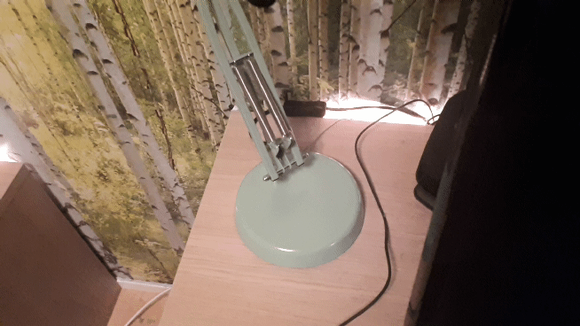

# PIC Capacitive Touch

For an explanation of how to use the code and wire up the circuit with a PIC16F886 check out <a href="https://www.instructables.com/Capacitive-Touch-With-PIC16F886-Microcontroller/" target="_blank">my instructables page about capacitive touch</a>, or <a href="https://www.instructables.com/Capacitive-Touch-With-PIC12F675/" target="_blank">this instructable</a> for the PIC12F675.

I ended up having a few circuit boards manufactured for the PIC12F675.

